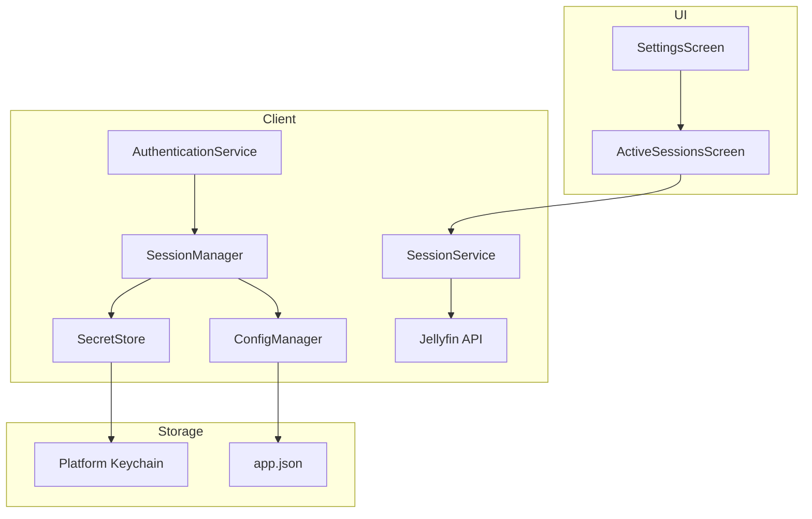
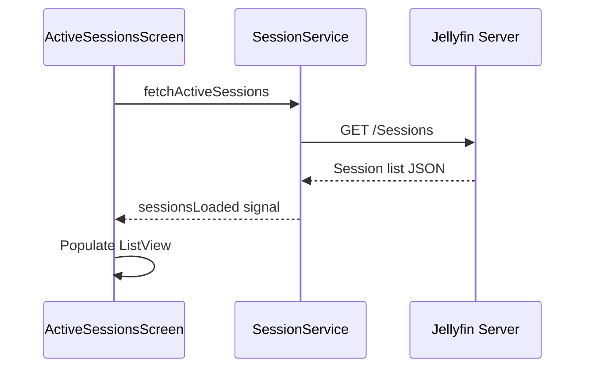
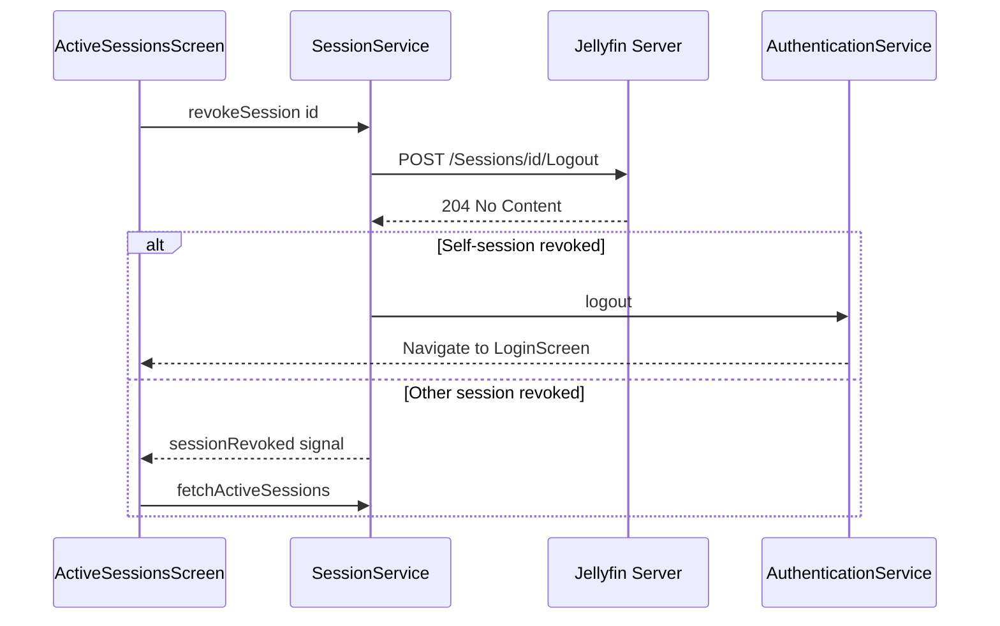
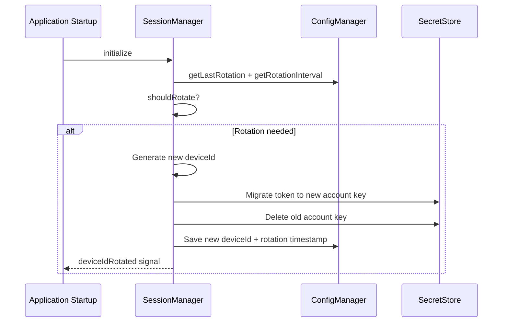

# Device-Specific Session Management Plan

## Overview

Implement a comprehensive session management system that allows concurrent active sessions across multiple devices, with UI for viewing and revoking sessions.

## Architecture



## Components

### 1. SessionManager (new: `src/network/SessionManager.h/.cpp`)

Central coordinator for device session state:

- **Device ID management**: Generate, persist, rotate device IDs
- **Session metadata**: Track device name, type, last active time
- **Rotation policy**: Configurable device ID rotation interval

Key API:
```cpp
class SessionManager : public QObject {
    Q_PROPERTY(QString deviceId READ deviceId NOTIFY deviceIdChanged)
    Q_PROPERTY(QString deviceName READ deviceName WRITE setDeviceName)
    Q_PROPERTY(QDateTime lastRotation READ lastRotation)
    
    QString deviceId() const;
    QString deviceName() const;
    void rotateDeviceId();  // Force rotation
    bool shouldRotate() const;  // Check policy
signals:
    void deviceIdChanged();
    void deviceIdRotated(QString oldId, QString newId);
};
```

### 2. SessionService (new: `src/network/SessionService.h/.cpp`)

Wraps Jellyfin `/Sessions` API:

```cpp
class SessionService : public QObject {
    Q_INVOKABLE void fetchActiveSessions();
    Q_INVOKABLE void revokeSession(const QString &sessionId);
    Q_INVOKABLE void revokeAllOtherSessions();
    
signals:
    void sessionsLoaded(QVariantList sessions);
    void sessionRevoked(QString sessionId);
    void selfSessionRevoked();  // Current device was logged out
};
```

Jellyfin endpoints used:
- `GET /Sessions` - List active sessions
- `POST /Sessions/{id}/Logout` - Revoke a session  
- `DELETE /Sessions/{id}` - Alternative revocation

### 3. ISecretStore Extension

Add session enumeration capability:

```cpp
// New method in ISecretStore interface
virtual QStringList listAccounts(const QString &service) = 0;
```

Platform implementations:
- **Linux**: Use `secret_password_search_sync` with Secret Service API
- **Windows**: Enumerate credentials via `CredEnumerate`

### 4. ConfigManager Additions

New settings in `app.json`:

```json
{
  "settings": {
    "session": {
      "device_name": "Living Room TV",
      "device_type": "htpc",
      "device_id_rotation_days": 90,
      "last_device_id_rotation": "2026-01-01T00:00:00Z",
      "session_timeout_minutes": 0
    }
  }
}
```

New Q_PROPERTYs:
- `deviceName` - User-friendly device identifier
- `deviceType` - htpc/mobile/desktop/browser
- `deviceIdRotationDays` - Rotation interval (0 = never)
- `sessionTimeoutMinutes` - Local expiration (0 = rely on server)

### 5. UI Components

#### ActiveSessionsScreen.qml

10-foot navigable list showing:
- Device name + icon based on type
- Last active timestamp
- Current session indicator
- Revoke button per session
- "Revoke All Others" button

```qml
FocusScope {
    ListView {
        model: sessionService.sessions
        delegate: SessionDelegate {
            deviceName: model.deviceName
            lastActive: model.lastActivityDate
            isCurrent: model.id === sessionManager.currentSessionId
            onRevoke: sessionService.revokeSession(model.id)
        }
    }
}
```

#### SettingsScreen Addition

New "Device & Sessions" section:
- Device name text input
- View active sessions button
- Device ID rotation toggle + interval

## Security Considerations

1. **Device ID rotation**: Mitigates long-term tracking, configurable 30-180 day default
2. **Token isolation**: Each device has unique token, revoking one doesn't affect others
3. **Self-revocation handling**: Detect when current session is revoked, redirect to login
4. **Secure storage**: Continue using platform keychain (libsecret/Credential Manager)

## Migration

For existing users:
- Preserve current device ID
- Set default device name from hostname
- No action required, backward compatible

## API Flow Diagrams

### Session Listing


### Session Revocation


### Device ID Rotation


## Files to Create/Modify

### New Files
- `src/network/SessionManager.h`
- `src/network/SessionManager.cpp`  
- `src/network/SessionService.h`
- `src/network/SessionService.cpp`
- `src/ui/ActiveSessionsScreen.qml`
- `tests/SessionManagerTest.cpp`

### Modified Files
- `src/security/ISecretStore.h` - Add `listAccounts`
- `src/security/SecretStoreLinux.h/.cpp` - Implement listing
- `src/security/SecretStoreWindows.h/.cpp` - Implement listing
- `src/utils/ConfigManager.h/.cpp` - Session settings
- `src/ui/SettingsScreen.qml` - Add session section
- `src/core/ServiceLocator.h/.cpp` - Register SessionManager/Service
- `src/CMakeLists.txt` - New source files
- `docs/services.md` - Document new services
